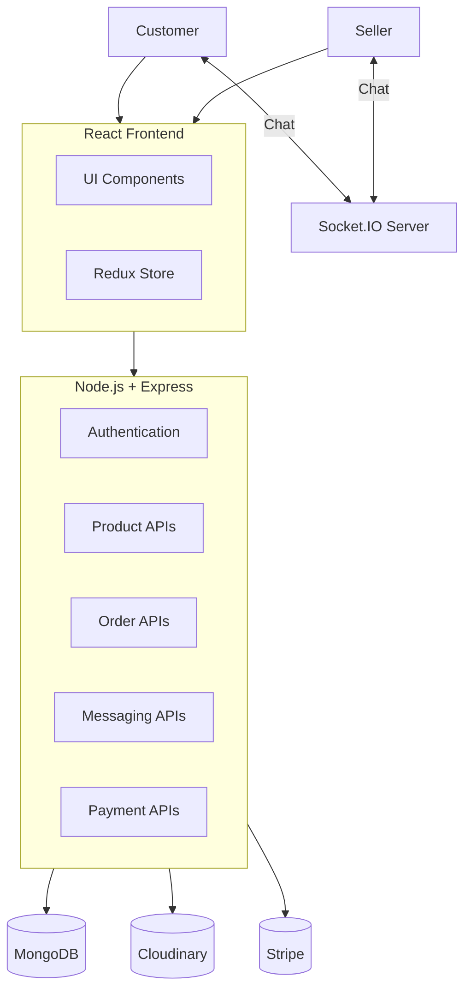
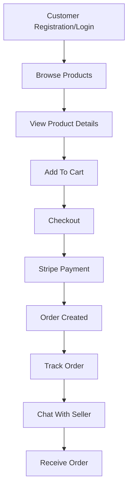
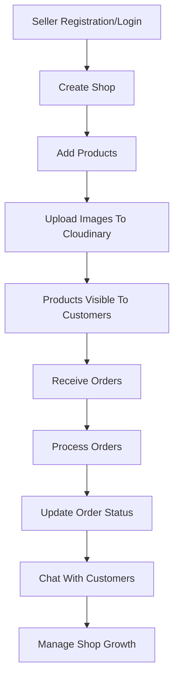

# Multi-Vendor E-Commerce Platform  ([Live Demo](https://multi-vendor-e-commerce-lime.vercel.app/))

## Overview

The Multi-Vendor E-Commerce Platform is a full-stack marketplace application built using the MERN Stack (MongoDB, Express.js, React.js, and Node.js).

The platform connects customers and sellers in a single ecosystem where customers can browse products, place orders, track purchases, and communicate directly with sellers. Sellers can manage their shops, products, orders, and customer interactions through a dedicated seller dashboard.

The project also includes real-time messaging, secure authentication, cloud-based image storage, and online payment processing to provide a complete e-commerce experience.

---

# Goals of the Project

The main objective of this project was to build a scalable multi-vendor marketplace that supports both customers and sellers.

### Customer Features

* Browse products from multiple sellers
* Search and filter products
* Add products to cart and wishlist
* Place and track orders
* Secure online payments
* Communicate directly with sellers

### Seller Features

* Create and manage a shop
* Add, update, and delete products
* Process customer orders
* Manage inventory
* Track shop performance
* Chat with customers in real time

---

# System Architecture Overview

The application follows a modern full-stack architecture where the frontend communicates with REST APIs, data is stored in MongoDB, images are managed through Cloudinary, and Socket.IO enables real-time communication.

| Layer          | Technology            | Purpose             |
| -------------- | --------------------- | ------------------- |
| Frontend       | React + Redux Toolkit | User Interface      |
| Backend        | Node.js + Express.js  | REST APIs           |
| Database       | MongoDB + Mongoose    | Data Storage        |
| Authentication | JWT + bcrypt          | User Authentication |
| Real-Time      | Socket.IO             | Live Messaging      |
| Media Storage  | Cloudinary            | Image Storage       |
| Payments       | Stripe                | Online Payments     |
| Deployment     | Vercel                | Hosting             |

### System Architecture Diagram

---

# Customer Flow

The following diagram shows how a customer interacts with the platform from product discovery to order completion.

---

# Seller Flow

The seller dashboard provides tools for managing products, orders, and customer communication.

---

# Key Features

## Authentication & Security

* JWT Authentication
* Password Hashing using bcrypt
* Protected Routes
* Secure User Sessions

## Product Management

* Product Creation and Updates
* Product Categories
* Inventory Management
* Product Search and Filtering

## Shopping Experience

* Shopping Cart
* Wishlist
* Order Placement
* Order Tracking

## Real-Time Messaging

* Buyer-Seller Communication
* Instant Message Delivery
* Socket.IO Integration

## Payment Processing

* Secure Stripe Integration
* Online Checkout
* Payment Verification

## Cloud Storage

* Product Images
* User Avatars
* Shop Images

---

# Tech Stack

### Frontend

* React.js
* Redux Toolkit
* React Router
* Axios

### Backend

* Node.js
* Express.js
* MongoDB
* Mongoose

### Authentication

* JWT
* bcrypt

### Real-Time Communication

* Socket.IO

### Payments

* Stripe

### Media Storage

* Cloudinary

### Deployment

* Vercel

---

# Challenges & Solutions

| Challenge                   | Solution                                                          |
| --------------------------- | ----------------------------------------------------------------- |
| Authentication token issues | Improved JWT handling and protected route management              |
| Redux data flow issues      | Organized state using Redux Toolkit slices                        |
| Payment integration         | Implemented and tested Stripe payment workflows                   |
| Real-time messaging         | Used Socket.IO for instant buyer-seller communication             |
| Production deployment       | Configured environment variables and deployment settings properly |

---

# What I Learned

Through this project, I gained practical experience with:

* Full-Stack MERN Development
* REST API Design
* MongoDB Data Modeling
* JWT Authentication
* Stripe Payment Integration
* Cloudinary Media Management
* Socket.IO Real-Time Communication
* Redux State Management
* Production Deployment

---

# Future Improvements

Potential enhancements for future versions:

* Product Recommendation System
* Push Notifications
* Seller Analytics Dashboard
* Advanced Search Filters
* Review Moderation
* AI ChatBot

---

# Conclusion

The Multi-Vendor E-Commerce Platform demonstrates the development of a complete marketplace solution using modern web technologies. The project combines secure authentication, product management, online payments, cloud media storage, and real-time communication into a scalable and production-ready application.

This project significantly improved my understanding of full-stack development, system architecture, database design, and real-world software engineering practices.
